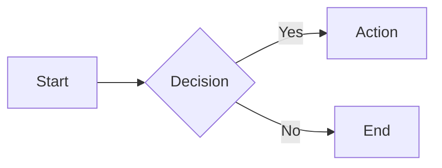

# Documentation Management Skill

Modern documentation website creation and management using MkDocs with Material theme.

## Quick Start

### Initialize New Documentation Project

```bash
python scripts/init_docs.py [project-dir]
```

Creates a documentation project with:
- Modern Material Design theme (light/dark mode)
- Full-text search
- Mobile responsive layout
- Code syntax highlighting
- Mermaid diagram support
- Admonitions, tabs, and task lists

### Preview Locally

```bash
python scripts/serve_docs.py [project-dir] --port 8000
```

Starts local server with live reload at http://localhost:8000

### Build for Production

```bash
python scripts/build_docs.py [project-dir] --strict
```

Generates static site in `site/` directory. Use `--strict` to treat warnings as errors.

### Deploy to GitHub Pages

```bash
python scripts/deploy_docs.py [project-dir] -m "Update documentation"
```

Automatically builds and deploys to GitHub Pages (gh-pages branch).

## Project Structure

After initialization:

```
project/
├── mkdocs.yml          # Configuration file
├── docs/               # Documentation source
│   └── index.md        # Home page
└── site/               # Built output (generated)
```

## Configuration

The generated `mkdocs.yml` includes:

**Theme Features:**
- Navigation tabs and sections
- Search with suggestions
- Code copy buttons
- Dark/light mode toggle
- Top navigation

**Markdown Extensions:**
- Code highlighting with line numbers
- Mermaid diagrams
- Admonitions (notes, warnings, tips)
- Tabbed content
- Task lists
- Emoji support

**Customization:**
Edit `mkdocs.yml` to:
- Change site name and description
- Customize color scheme (primary/accent colors)
- Add navigation structure
- Configure plugins
- Update social links

## Common Tasks

### Add New Page

1. Create markdown file in `docs/` directory:
   ```bash
   echo "# New Page" > docs/new-page.md
   ```

2. Add to navigation in `mkdocs.yml`:
   ```yaml
   nav:
     - Home: index.md
     - New Page: new-page.md
   ```

### Add Subsections

Organize content in subdirectories:

```
docs/
├── index.md
├── getting-started/
│   ├── installation.md
│   └── quickstart.md
└── guides/
    ├── basic.md
    └── advanced.md
```

Update navigation:

```yaml
nav:
  - Home: index.md
  - Getting Started:
      - Installation: getting-started/installation.md
      - Quickstart: getting-started/quickstart.md
  - Guides:
      - Basic: guides/basic.md
      - Advanced: guides/advanced.md
```

### Use Advanced Markdown Features

**Admonitions:**
```markdown
!!! note "Custom Title"
    This is a note admonition.

!!! warning
    This is a warning.

!!! tip
    This is a tip.
```

**Code with Highlighting:**
```markdown
```python hl_lines="2 3"
def hello():
    # These lines are highlighted
    print("Hello, World!")
```
```

**Mermaid Diagrams:**
```markdown

```

**Tabs:**
```markdown
=== "Python"
    ```python
    print("Hello")
    ```

=== "JavaScript"
    ```javascript
    console.log("Hello");
    ```
```

**Task Lists:**
```markdown
- [x] Completed task
- [ ] Pending task
- [ ] Another task
```

## GitHub Pages Setup

### First-Time Setup

1. Enable GitHub Pages in repository settings:
   - Go to Settings → Pages
   - Source: Deploy from a branch
   - Branch: `gh-pages` / `root`

2. Deploy documentation:
   ```bash
   python scripts/deploy_docs.py
   ```

3. Access at: `https://<username>.github.io/<repository>/`

### Custom Domain (Optional)

Add to `mkdocs.yml`:

```yaml
site_url: https://docs.example.com
```

Configure CNAME in repository settings.

## Dependencies

Install MkDocs Material:

```bash
pip install mkdocs-material
```

Or add to `pyproject.toml`:

```toml
[project]
dependencies = [
    "mkdocs-material>=9.0.0",
]
```

## Workflow Integration

### GitHub Actions (Optional)

Create `.github/workflows/docs.yml`:

```yaml
name: Deploy Documentation
on:
  push:
    branches: [main]
jobs:
  deploy:
    runs-on: ubuntu-latest
    steps:
      - uses: actions/checkout@v3
      - uses: actions/setup-python@v4
        with:
          python-version: 3.x
      - run: pip install mkdocs-material
      - run: mkdocs gh-deploy --force
```

## Troubleshooting

**"mkdocs.yml not found"**: Run `init_docs.py` first to initialize project.

**Port already in use**: Use `--port` flag with different port number.

**GitHub Pages not updating**: 
- Check gh-pages branch exists
- Verify GitHub Pages is enabled in repository settings
- Wait a few minutes for changes to propagate

**Build warnings**: Use `--strict` flag to catch all warnings before deploying.

## Best Practices

1. **Version control**: Commit `mkdocs.yml` and `docs/`, exclude `site/`
2. **Preview first**: Always test with `serve_docs.py` before deploying
3. **Strict mode**: Use `--strict` in build to catch issues early
4. **Navigation**: Keep navigation structure logical and shallow (max 3 levels)
5. **Images**: Store in `docs/assets/` or `docs/images/` subdirectory
6. **Links**: Use relative paths for internal links

## Theme Customization

### Change Colors

Edit `mkdocs.yml`:

```yaml
theme:
  palette:
    - scheme: default
      primary: blue  # blue, indigo, purple, pink, red, etc.
      accent: amber
```

### Add Logo and Favicon

```yaml
theme:
  logo: assets/logo.png
  favicon: assets/favicon.png
```

Place files in `docs/assets/`.

### Custom CSS

1. Create `docs/stylesheets/extra.css`
2. Add to `mkdocs.yml`:
   ```yaml
   extra_css:
     - stylesheets/extra.css
   ```

## Script Reference

All scripts accept `[project-dir]` as optional first argument (defaults to current directory).

- `init_docs.py` - Initialize new documentation project
- `serve_docs.py` - Serve locally with live reload (--port, --host)
- `build_docs.py` - Build production site (--strict, --no-clean)
- `deploy_docs.py` - Deploy to GitHub Pages (-m message, --force)

Scripts are located in the skill's `scripts/` directory. Reference them with full path or copy to project.
