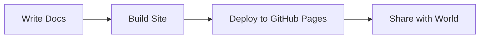

# Example Documentation Homepage

Welcome to your documentation site!

## Features

This documentation site is built with MkDocs Material and includes:

- 🎨 **Modern Design** - Beautiful Material Design theme with dark mode
- 🔍 **Full-Text Search** - Fast client-side search
- 📱 **Mobile Responsive** - Works perfectly on all devices
- 💻 **Code Highlighting** - Syntax highlighting for 100+ languages
- 📊 **Diagrams** - Mermaid diagram support
- ⚡ **Fast** - Static site generation for instant loading

## Getting Started

Check out these sections to get started:

- [Installation Guide](guides/installation.md) - How to install and set up
- [Quick Start](guides/quickstart.md) - Get up and running quickly
- [API Reference](api/overview.md) - Complete API documentation

## Example Code

Here's a quick example:

```python
def hello_world():
    """Print a friendly greeting."""
    print("Hello, World!")

if __name__ == "__main__":
    hello_world()
```

## Admonitions

!!! tip "Pro Tip"
    Use admonitions to highlight important information!

!!! note
    This is a note admonition.

!!! warning "Important"
    Pay attention to warnings!

## Diagrams



## Need Help?

- 📚 Read the [User Guide](guides/user-guide.md)
- 💬 Join our [Community Discussion](https://github.com/yourproject/discussions)
- 🐛 Report [Issues](https://github.com/yourproject/issues)
