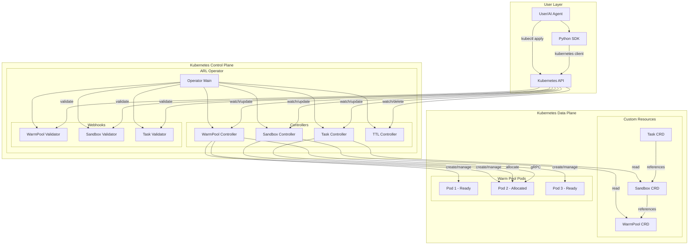
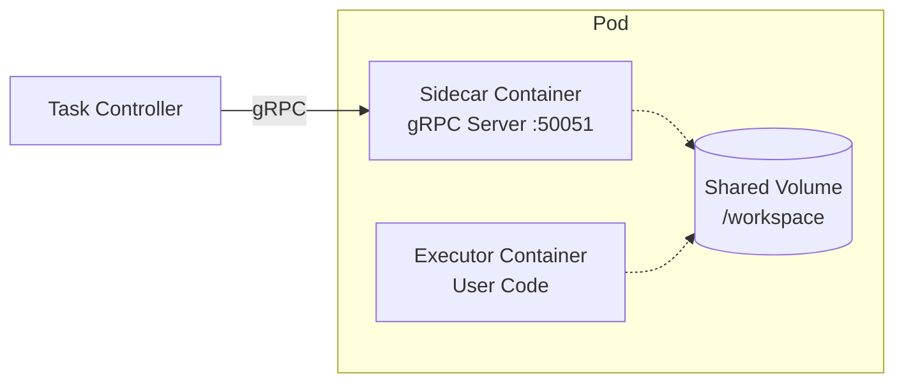
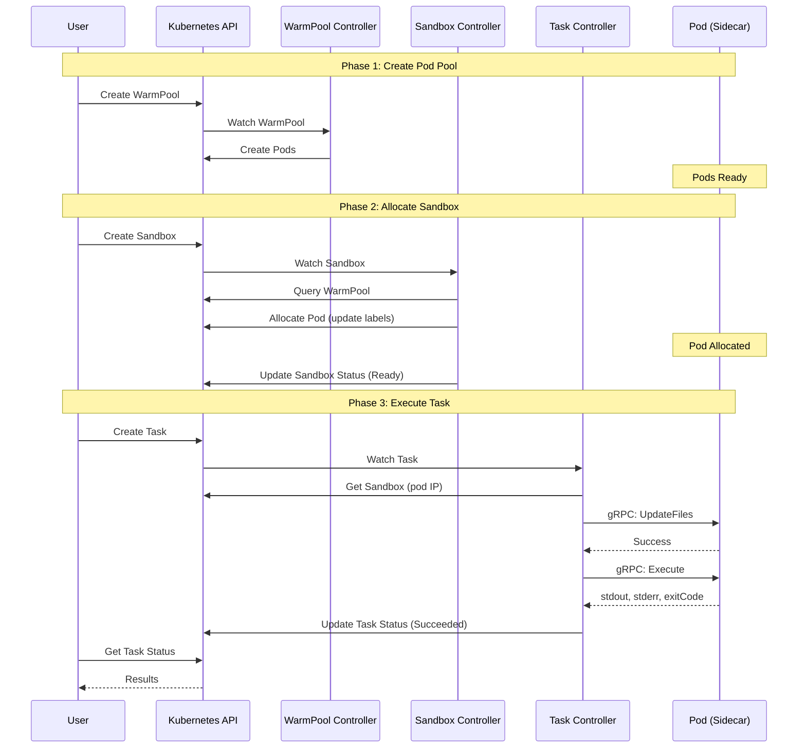
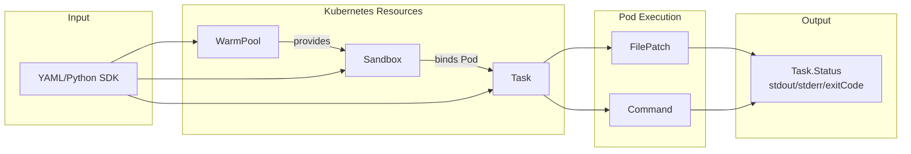

# Architecture

This document describes the architecture of ARL-Infra, including its components, interactions, and design decisions.

## Overview

ARL-Infra consists of two main planes:

- **Control Plane**: The ARL Operator that manages resources and orchestrates execution
- **Data Plane**: Warm pool pods with sidecar agents for code execution



## Core Components

### ARL Operator

The operator is the central control component running in the `arl-system` namespace.

| Component | Responsibility |
|-----------|----------------|
| **WarmPool Controller** | Maintains pod pools, ensures desired replica count |
| **Sandbox Controller** | Allocates pods from pools, manages sandbox lifecycle |
| **Task Controller** | Executes tasks via gRPC calls to sidecars |
| **TTL Controller** | Cleans up completed tasks and idle sandboxes |
| **Webhooks** | Validates CRD resources before creation |

### Sidecar Agent

Each pod in the warm pool includes a sidecar container that:

- Runs a gRPC server on port 50051
- Handles file operations (create, update, delete)
- Executes commands in the executor container
- Returns stdout, stderr, and exit codes



### Custom Resources

#### WarmPool

Defines a pool of pre-created pods.

```yaml
apiVersion: arl.infra.io/v1alpha1
kind: WarmPool
metadata:
  name: python-pool
spec:
  replicas: 3           # Number of pods to maintain
  template:             # Pod template
    spec:
      containers:
        - name: executor
          image: python:3.9-slim
```

#### Sandbox

Represents an allocated workspace.

```yaml
apiVersion: arl.infra.io/v1alpha1
kind: Sandbox
metadata:
  name: my-sandbox
spec:
  poolRef: python-pool  # Which pool to allocate from
  keepAlive: true       # Keep for multiple tasks
```

#### Task

A unit of work to execute.

```yaml
apiVersion: arl.infra.io/v1alpha1
kind: Task
metadata:
  name: my-task
spec:
  sandboxRef: my-sandbox
  timeout: 30s
  steps:
    - name: run
      type: Command
      command: ["python", "-c", "print('hello')"]
```

## Interaction Flow

### Task Execution Flow



### Data Flow



## Design Decisions

### Why Warm Pools?

| Approach | Latency | Resource Usage | Isolation |
|----------|---------|----------------|-----------|
| Create pod per task | 5-30s | Low | High |
| Shared long-running pod | <100ms | Medium | Low |
| **Warm pool** | <100ms | Medium | High |

Warm pools provide the best balance of low latency and strong isolation.

### Why Sidecar Architecture?

- **Separation of concerns**: Sidecar handles orchestration, executor runs user code
- **Language agnostic**: Any container image can be used as executor
- **Security**: Sidecar has limited permissions, user code is sandboxed
- **Observability**: Sidecar can collect metrics and logs

### Why CRD-based API?

- **Kubernetes-native**: Uses familiar kubectl commands
- **Declarative**: Desired state is explicitly defined
- **Extensible**: Easy to add new resource types
- **Auditable**: All changes tracked by Kubernetes

## Directory Structure

```
agent-env/
├── api/                    # CRD type definitions
│   └── v1alpha1/
├── cmd/
│   ├── operator/          # Operator entrypoint
│   └── sidecar/           # Sidecar entrypoint
├── config/
│   └── crd/               # Generated CRD manifests
├── pkg/
│   ├── controllers/       # Reconciliation logic
│   ├── pb/                # Generated protobuf code
│   └── webhooks/          # Validation webhooks
├── proto/                 # Protocol buffer definitions
├── sdk/python/            # Python SDK
└── charts/                # Helm charts
```
