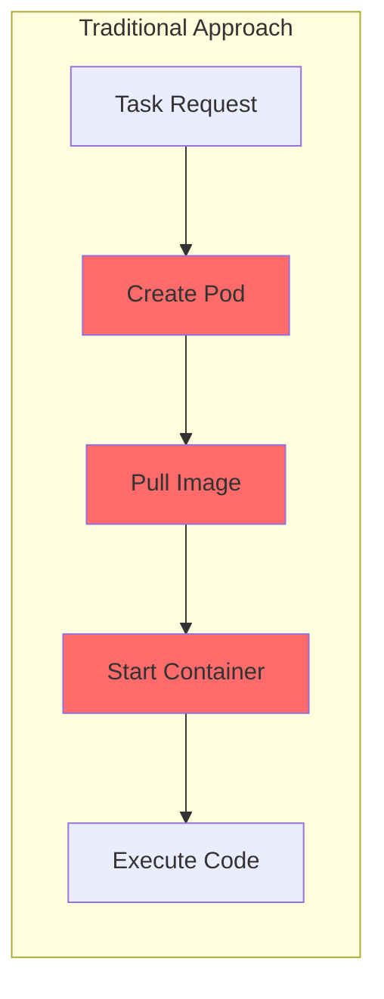
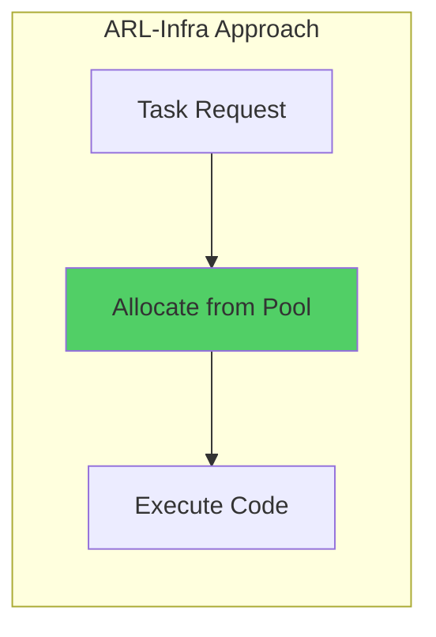
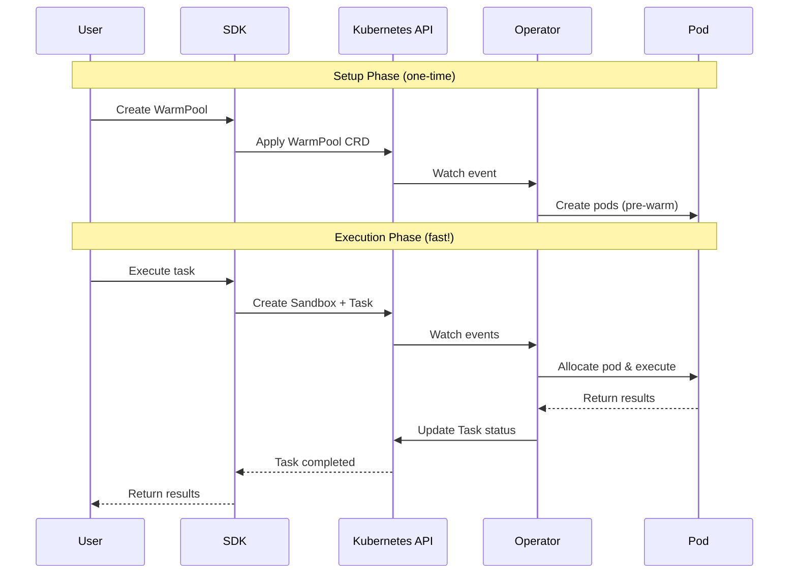

# Overview

ARL-Infra provides a Kubernetes-native infrastructure for AI agent code execution with ultra-low latency.

## The Problem

Traditional approaches to running agent code in Kubernetes face significant challenges:

- **Cold start latency**: Creating a new pod for each task takes 5-30 seconds
- **Resource overhead**: Maintaining always-on pods is expensive
- **Isolation**: Running multiple tasks in shared environments creates security risks

## The Solution

ARL-Infra solves these problems with a warm pool architecture:





## Core Concepts

### 1. WarmPool

A **WarmPool** maintains a set of pre-created pods ready for instant allocation. Think of it as a "parking lot" with reserved spots.

```yaml
apiVersion: arl.infra.io/v1alpha1
kind: WarmPool
metadata:
  name: python-pool
spec:
  replicas: 3  # Keep 3 pods ready
```

### 2. Sandbox

A **Sandbox** is your workspace - a pod allocated from the warm pool. It's your "reserved parking spot."

```yaml
apiVersion: arl.infra.io/v1alpha1
kind: Sandbox
metadata:
  name: my-workspace
spec:
  poolRef: python-pool
```

### 3. Task

A **Task** is a unit of work executed in a sandbox - the "parking and retrieval operation."

```yaml
apiVersion: arl.infra.io/v1alpha1
kind: Task
metadata:
  name: run-code
spec:
  sandboxRef: my-workspace
  steps:
    - name: execute
      type: Command
      command: ["python", "-c", "print('Hello!')"]
```

## Workflow



## Choose Your Path

Based on your role, proceed to the appropriate guide:

| Role | Description | Next Steps |
|------|-------------|------------|
| **Developer / Operator** | Deploy and manage ARL-Infra | [Developer Getting Started](developers.md) |
| **SDK User** | Use Python SDK only | [SDK User Getting Started](sdk-users.md) |
