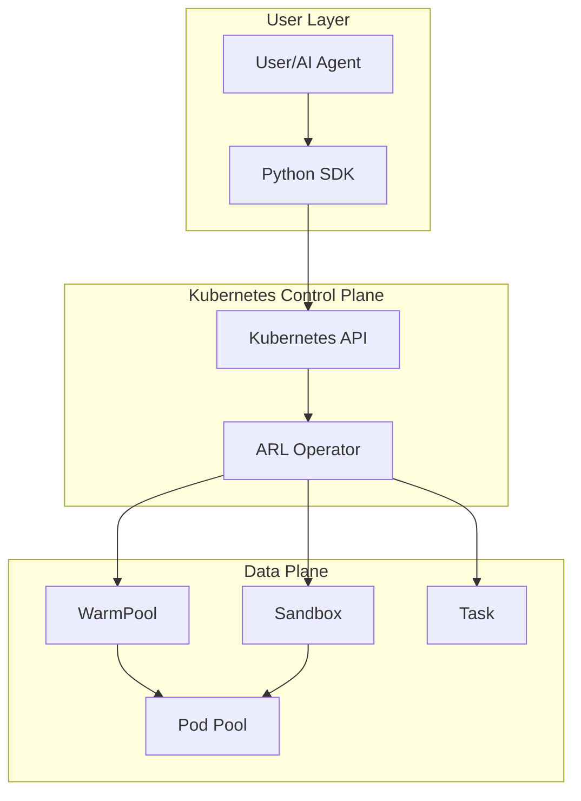

# ARL-Infra

**Kubernetes Operator for Agentic Reinforcement Learning environments with warm pool and sidecar injection for ultra-low latency code execution.**

---

## What is ARL-Infra?

ARL-Infra is a Kubernetes-native infrastructure designed to provide AI agents with **ultra-low latency code execution environments**. It eliminates pod startup delays by maintaining warm pools of pre-created pods, allowing agents to execute code instantly.

## Key Features

- :zap: **Ultra-low latency**: Bypasses pod startup time using warm pools
- :shield: **Isolation**: Each sandbox runs in an isolated environment
- :fire: **Hot code reload**: Update and execute code without pod restarts
- :kubernetes: **Kubernetes-native**: CRD-based API, standard K8s tooling
- :snake: **Python SDK**: High-level API for seamless integration

## Who is this for?

-   :material-server:{ .lg .middle } **Developers / Operators**

    ---

    Deploy and manage ARL-Infra services on Kubernetes clusters.

    [:octicons-arrow-right-24: Developer Guide](developer-guide/architecture.md)

-   :material-language-python:{ .lg .middle } **SDK Users**

    ---

    Use the Python SDK to execute code in sandboxed environments.

    [:octicons-arrow-right-24: User Guide](user-guide/python-sdk.md)

## Quick Navigation

| I want to... | Go to |
|--------------|-------|
| Understand the architecture | [Architecture Overview](developer-guide/architecture.md) |
| Deploy ARL-Infra to my cluster | [Installation Guide](developer-guide/installation.md) |
| Use the Python SDK | [Python SDK Guide](user-guide/python-sdk.md) |
| See examples | [Examples](user-guide/examples.md) |
| Learn about CRDs | [CRD Reference](developer-guide/crd-reference.md) |

## Architecture at a Glance

## Getting Started

Choose your path:

=== "I'm deploying the service"

    1. [Review the architecture](developer-guide/architecture.md)
    2. [Install prerequisites](developer-guide/installation.md)
    3. [Deploy to Kubernetes](developer-guide/deployment.md)

=== "I'm using the Python SDK"

    1. [Install the SDK](user-guide/python-sdk.md)
    2. [Follow the quickstart](user-guide/quickstart.md)
    3. [Explore examples](user-guide/examples.md)

## License

This project is open source. See the repository for license details.
