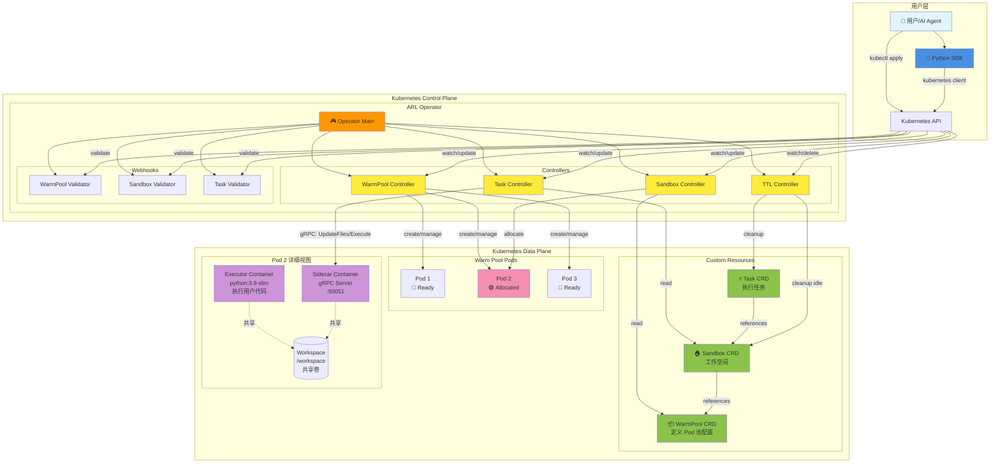
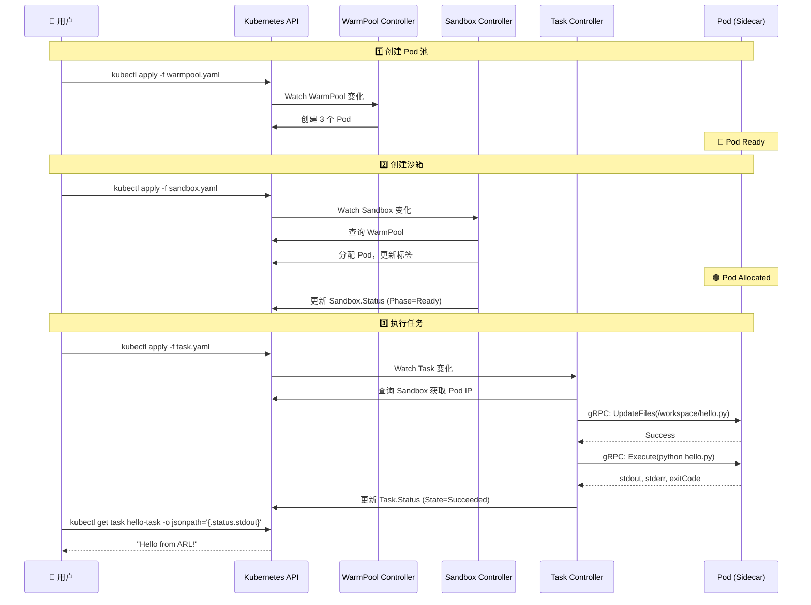
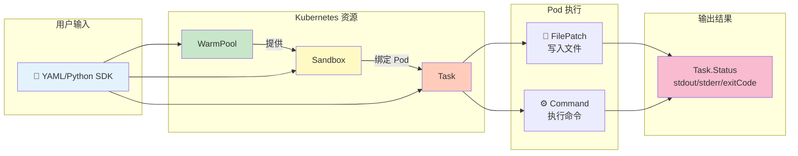

# ARL-Infra Operator 用户手册

## 📋 什么是 ARL-Infra？

ARL-Infra 是一个 Kubernetes Operator，为 AI Agent 提供**超低延迟的代码执行环境**。

---

## 🏗️ 系统架构

### 整体架构图



### 核心组件说明

| 组件 | 类型 | 职责 |
|------|------|------|
| **Operator** | 控制器管理器 | 启动和管理所有 Controller 和 Webhook |
| **WarmPool Controller** | 控制器 | 维护 Pod 池，确保有足够的空闲 Pod |
| **Sandbox Controller** | 控制器 | 从 Pool 分配 Pod，管理 Sandbox 生命周期 |
| **Task Controller** | 控制器 | 通过 gRPC 调用 Sidecar 执行任务 |
| **TTL Controller** | 控制器 | 清理完成的 Task 和空闲的 Sandbox |
| **Sidecar** | gRPC 服务器 | 在 Pod 中执行文件操作和命令 |
| **Executor** | 用户容器 | 实际运行用户代码的容器 |

### 交互流程



### 数据流



---

## 🎯 核心概念

使用 ARL-Infra 需要理解三种资源，它们按顺序协同工作：

### 1. WarmPool（Pod 池）
预先创建一组 Pod，等待分配使用。

### 2. Sandbox（沙箱）
从 Pool 中分配一个 Pod，作为你的工作空间。

### 3. Task（任务）
在 Sandbox 中执行具体的代码和命令。

**简单理解：**
```
WarmPool = 停车场（预留车位）
Sandbox  = 你租的车位
Task     = 停车和取车的操作
```

---

## 🚀 快速开始

### 第一步：创建 Pod 池

```yaml
# warmpool.yaml
apiVersion: arl.infra.io/v1alpha1
kind: WarmPool
metadata:
  name: python-pool
spec:
  replicas: 3                    # 保持 3 个空闲 Pod
  template:
    spec:
      containers:
        - name: executor
          image: python:3.9-slim
          command: ["sleep", "infinity"]
          volumeMounts:
            - name: workspace
              mountPath: /workspace
      volumes:
        - name: workspace
          emptyDir: {}
```

```bash
kubectl apply -f warmpool.yaml
```

---

### 第二步：创建沙箱

```yaml
# sandbox.yaml
apiVersion: arl.infra.io/v1alpha1
kind: Sandbox
metadata:
  name: my-workspace
spec:
  poolRef: python-pool           # 使用哪个 Pool
  keepAlive: true                # 保持沙箱用于多次任务
```

```bash
kubectl apply -f sandbox.yaml

# 等待沙箱就绪
kubectl get sandbox my-workspace -w
# 等待 PHASE 变为 Ready
```

---

### 第三步：提交任务

```yaml
# task.yaml
apiVersion: arl.infra.io/v1alpha1
kind: Task
metadata:
  name: hello-task
spec:
  sandboxRef: my-workspace       # 在哪个沙箱执行
  timeout: 30s
  steps:
    # 步骤 1: 写入 Python 文件
    - name: write-code
      type: FilePatch
      path: /workspace/hello.py
      content: |
        print("Hello from ARL!")
        print("Task executed successfully")
    
    # 步骤 2: 执行 Python 文件
    - name: run-code
      type: Command
      command: ["python", "/workspace/hello.py"]
```

```bash
kubectl apply -f task.yaml
```

---

### 第四步：查看结果

```bash
# 1. 查看任务状态
kubectl get task hello-task

# 2. 查看输出结果
kubectl get task hello-task -o jsonpath='{.status.stdout}'

# 3. 查看错误信息（如果有）
kubectl get task hello-task -o jsonpath='{.status.stderr}'

# 4. 查看退出码
kubectl get task hello-task -o jsonpath='{.status.exitCode}'

# 5. 查看完整状态
kubectl describe task hello-task
```

**预期输出：**
```
Hello from ARL!
Task executed successfully
```

---

## 📝 Task 步骤类型

### FilePatch - 创建/更新文件

```yaml
- name: create-script
  type: FilePatch
  path: /workspace/app.py        # 文件路径
  content: |                     # 文件内容
    import json
    print("Processing data...")
```

### Command - 执行命令

```yaml
- name: run-script
  type: Command
  command: ["python", "app.py"]  # 命令数组
  workDir: /workspace            # 工作目录（可选）
  env:                           # 环境变量（可选）
    DEBUG: "true"
    API_KEY: "xyz"
```

---

## �️ Host 类型任务（长期交互）

对于需要**长时间运行**并与之**持续交互**的任务（如开发服务器、数据库、REPL 环境），ARL-Infra 提供了 Host 模式。

### Host 模式的特点

- **后台运行**：进程在后台持续运行，不会阻塞任务完成
- **进程跟踪**：Sidecar 记录后台进程的 PID
- **信号控制**：可以通过 API 发送信号（SIGTERM/SIGINT/SIGKILL）
- **持续交互**：可以通过多个 Task 与同一个后台进程交互

### 使用场景

- 启动 Web 服务器（Flask、FastAPI、Node.js）
- 运行数据库（Redis、PostgreSQL）
- 启动 Jupyter Notebook
- 启动交互式 Shell（bash、Python REPL）
- 运行监控程序或日志收集器

---

### 方式一：通过 Sidecar HTTP API（推荐）

这是最灵活的方式，适合需要精确控制进程生命周期的场景。

#### 1. 启动后台进程

直接调用 Sidecar 的 HTTP API（Sidecar 默认在 Pod 的 8080 端口）：

```bash
# 获取 Pod IP
POD_IP=$(kubectl get sandbox my-workspace -o jsonpath='{.status.podIP}')

# 启动 Python Web 服务器（后台模式）
curl -X POST http://${POD_IP}:8080/execute \
  -H "Content-Type: application/json" \
  -d '{
    "command": ["python", "-m", "http.server", "8000"],
    "working_dir": "/workspace",
    "background": true,
    "env": {
      "PYTHONUNBUFFERED": "1"
    }
  }'
```

**响应示例：**
```json
{
  "stdout": "",
  "stderr": "",
  "exit_code": 0,
  "done": false
}
```

进程将在后台持续运行，Sidecar 会记录其 PID。

#### 2. 与后台进程交互

后台进程运行后，可以通过新的命令与之交互：

```bash
# 测试 Web 服务器是否正在运行
curl -X POST http://${POD_IP}:8080/execute \
  -H "Content-Type: application/json" \
  -d '{
    "command": ["curl", "http://localhost:8000"],
    "timeout_seconds": 5
  }'
```

#### 3. 查看进程状态

```bash
# 列出所有运行的进程
curl -X POST http://${POD_IP}:8080/execute \
  -H "Content-Type: application/json" \
  -d '{
    "command": ["ps", "aux"]
  }'
```

#### 4. 停止后台进程

使用 Signal API 发送信号：

```bash
# 先找到进程 PID
PROCESS_PID=$(curl -X POST http://${POD_IP}:8080/execute \
  -H "Content-Type: application/json" \
  -d '{"command": ["pgrep", "-f", "http.server"]}' | jq -r '.stdout' | tr -d '\n')

# 发送 SIGTERM 优雅停止
curl -X POST http://${POD_IP}:8080/signal \
  -H "Content-Type: application/json" \
  -d "{
    \"pid\": ${PROCESS_PID},
    \"signal\": \"SIGTERM\"
  }"

# 或发送 SIGKILL 强制终止
curl -X POST http://${POD_IP}:8080/signal \
  -H "Content-Type: application/json" \
  -d "{
    \"pid\": ${PROCESS_PID},
    \"signal\": \"SIGKILL\"
  }"
```

**响应示例：**
```json
{
  "success": true,
  "message": "signal SIGTERM sent to process 1234"
}
```

---

### 方式二：通过 Task 资源（简化版）

可以用 Task 启动后台进程，但需要注意 Task 会在命令"启动"后立即完成。

#### 示例 1：启动开发服务器

```yaml
apiVersion: arl.infra.io/v1alpha1
kind: Task
metadata:
  name: start-flask-server
spec:
  sandboxRef: my-workspace
  timeout: 10s
  steps:
    # 步骤 1: 创建 Flask 应用
    - name: create-app
      type: FilePatch
      path: /workspace/app.py
      content: |
        from flask import Flask
        app = Flask(__name__)
        
        @app.route('/')
        def hello():
            return 'Hello from ARL Host Mode!'
        
        if __name__ == '__main__':
            app.run(host='0.0.0.0', port=5000)
    
    # 步骤 2: 在后台启动服务器
    - name: start-server
      type: Command
      command: ["bash", "-c", "nohup python /workspace/app.py > /tmp/flask.log 2>&1 & echo $!"]
      # 使用 nohup 和 & 让进程后台运行
      # echo $! 输出进程 PID
```

应用后，查看 PID：

```bash
kubectl apply -f start-flask-server.yaml
kubectl wait --for=jsonpath='{.status.state}'=Succeeded task/start-flask-server --timeout=30s

# 获取后台进程 PID
FLASK_PID=$(kubectl get task start-flask-server -o jsonpath='{.status.stdout}' | tr -d '\n')
echo "Flask server PID: $FLASK_PID"
```

#### 示例 2：测试服务器是否运行

```yaml
apiVersion: arl.infra.io/v1alpha1
kind: Task
metadata:
  name: test-flask
spec:
  sandboxRef: my-workspace
  timeout: 10s
  steps:
    - name: wait-for-server
      type: Command
      command: ["sleep", "2"]  # 等待服务器启动
    
    - name: test-endpoint
      type: Command
      command: ["curl", "http://localhost:5000"]
```

```bash
kubectl apply -f test-flask.yaml
kubectl wait --for=jsonpath='{.status.state}'=Succeeded task/test-flask --timeout=30s
kubectl get task test-flask -o jsonpath='{.status.stdout}'
# 输出: Hello from ARL Host Mode!
```

#### 示例 3：停止服务器

```yaml
apiVersion: arl.infra.io/v1alpha1
kind: Task
metadata:
  name: stop-flask
spec:
  sandboxRef: my-workspace
  timeout: 10s
  steps:
    - name: stop-server
      type: Command
      command: ["pkill", "-f", "flask"]
      # 或使用 kill 命令: ["kill", "PID"]
```

---

### 方式三：交互式 Shell

启动一个交互式环境，通过 `kubectl exec` 直接操作：

```bash
# 1. 找到 Sandbox 绑定的 Pod
POD_NAME=$(kubectl get sandbox my-workspace -o jsonpath='{.status.podName}')

# 2. 进入 Pod 的交互式 Shell
kubectl exec -it $POD_NAME -c executor -- /bin/bash

# 3. 在 Shell 中启动后台进程
python -m http.server 8000 &
PYTHON_PID=$!
echo "Started HTTP server with PID: $PYTHON_PID"

# 4. 测试服务
curl http://localhost:8000

# 5. 停止服务
kill $PYTHON_PID
```

---

### 完整示例：Jupyter Notebook Host 模式

```yaml
---
# 1. 创建带 Jupyter 的 WarmPool
apiVersion: arl.infra.io/v1alpha1
kind: WarmPool
metadata:
  name: jupyter-pool
spec:
  replicas: 2
  template:
    spec:
      containers:
        - name: executor
          image: jupyter/scipy-notebook:latest
          command: ["sleep", "infinity"]
          ports:
            - containerPort: 8888
              name: jupyter
          volumeMounts:
            - name: workspace
              mountPath: /workspace
      volumes:
        - name: workspace
          emptyDir: {}

---
# 2. 创建 Sandbox
apiVersion: arl.infra.io/v1alpha1
kind: Sandbox
metadata:
  name: jupyter-workspace
spec:
  poolRef: jupyter-pool
  keepAlive: true

---
# 3. 启动 Jupyter Notebook
apiVersion: arl.infra.io/v1alpha1
kind: Task
metadata:
  name: start-jupyter
spec:
  sandboxRef: jupyter-workspace
  timeout: 30s
  steps:
    - name: start-notebook
      type: Command
      command:
        - bash
        - -c
        - |
          nohup jupyter notebook \
            --ip=0.0.0.0 \
            --port=8888 \
            --no-browser \
            --NotebookApp.token='' \
            --NotebookApp.password='' \
            --notebook-dir=/workspace \
            > /tmp/jupyter.log 2>&1 & 
          echo "Jupyter started with PID: $!"
          sleep 3
          cat /tmp/jupyter.log
```

**使用 Jupyter：**

```bash
# 1. 应用资源
kubectl apply -f jupyter-host.yaml

# 2. 等待启动
kubectl wait --for=jsonpath='{.status.state}'=Succeeded task/start-jupyter --timeout=60s

# 3. 获取 Pod IP
POD_IP=$(kubectl get sandbox jupyter-workspace -o jsonpath='{.status.podIP}')

# 4. 端口转发到本地
kubectl port-forward $(kubectl get sandbox jupyter-workspace -o jsonpath='{.status.podName}') 8888:8888

# 5. 在浏览器访问
# http://localhost:8888

# 6. 停止 Jupyter
kubectl apply -f - <<EOF
apiVersion: arl.infra.io/v1alpha1
kind: Task
metadata:
  name: stop-jupyter
spec:
  sandboxRef: jupyter-workspace
  timeout: 10s
  steps:
    - name: kill-jupyter
      type: Command
      command: ["pkill", "-f", "jupyter-notebook"]
EOF
```

---

### Host 模式最佳实践

#### 1. 使用 nohup 或 disown 防止进程终止

```yaml
- name: start-background
  type: Command
  command: ["bash", "-c", "nohup python server.py > /tmp/server.log 2>&1 &"]
  # nohup 确保进程在 Task 完成后继续运行
```

#### 2. 记录进程 PID 便于后续管理

```yaml
- name: start-and-record-pid
  type: Command
  command: 
    - bash
    - -c
    - |
      nohup python server.py > /tmp/server.log 2>&1 & 
      echo $! > /tmp/server.pid
      echo "Server started with PID: $(cat /tmp/server.pid)"
```

后续可以读取 PID：

```yaml
- name: get-pid
  type: Command
  command: ["cat", "/tmp/server.pid"]
```

#### 3. 等待服务启动完成

```yaml
- name: wait-for-service
  type: Command
  command:
    - bash
    - -c
    - |
      for i in {1..30}; do
        if curl -s http://localhost:5000 > /dev/null; then
          echo "Service is ready"
          exit 0
        fi
        echo "Waiting for service... ($i/30)"
        sleep 1
      done
      echo "Service failed to start"
      exit 1
```

#### 4. 优雅停止进程

```yaml
- name: graceful-shutdown
  type: Command
  command:
    - bash
    - -c
    - |
      if [ -f /tmp/server.pid ]; then
        PID=$(cat /tmp/server.pid)
        kill -SIGTERM $PID
        sleep 2
        # 如果进程还在运行，强制终止
        if ps -p $PID > /dev/null; then
          kill -SIGKILL $PID
        fi
        rm /tmp/server.pid
        echo "Server stopped"
      else
        echo "No PID file found"
      fi
```

#### 5. 日志管理

```yaml
- name: view-logs
  type: Command
  command: ["tail", "-n", "50", "/tmp/server.log"]

- name: clear-logs
  type: Command
  command: ["truncate", "-s", "0", "/tmp/server.log"]
```

---

### Host 模式 API 参考

#### Sidecar HTTP API 端点

| 端点 | 方法 | 描述 |
|------|------|------|
| `/execute` | POST | 执行命令（支持 `background: true`） |
| `/signal` | POST | 发送信号到进程 |
| `/reset` | POST | 清理所有后台进程和工作空间 |
| `/health` | GET | 健康检查 |

#### Execute API 请求格式

```json
{
  "command": ["python", "server.py"],
  "working_dir": "/workspace",
  "env": {
    "DEBUG": "true"
  },
  "background": true,
  "timeout_seconds": 0
}
```

#### Signal API 请求格式

```json
{
  "pid": 1234,
  "signal": "SIGTERM"
}
```

**支持的信号：**
- `SIGTERM`（优雅停止，15）
- `SIGINT`（中断，2）
- `SIGKILL`（强制终止，9）

#### Reset API 请求格式

```json
{
  "preserve_files": true
}
```

- `preserve_files: false`：删除所有文件并终止所有进程
- `preserve_files: true`：仅终止进程，保留文件

---

## �💡 完整示例

### 示例 1：数据处理任务

```yaml
apiVersion: arl.infra.io/v1alpha1
kind: Task
metadata:
  name: data-process
spec:
  sandboxRef: my-workspace
  timeout: 60s
  steps:
    - name: create-data
      type: FilePatch
      path: /workspace/data.json
      content: |
        {"users": [{"id": 1, "name": "Alice"}, {"id": 2, "name": "Bob"}]}
    
    - name: process-data
      type: FilePatch
      path: /workspace/process.py
      content: |
        import json
        with open('data.json') as f:
            data = json.load(f)
        print(f"Processed {len(data['users'])} users")
        for user in data['users']:
            print(f"  - {user['name']}")
    
    - name: run-process
      type: Command
      command: ["python", "process.py"]
      workDir: /workspace
```

**查看结果：**
```bash
kubectl apply -f data-process.yaml
kubectl wait --for=jsonpath='{.status.state}'=Succeeded task/data-process --timeout=60s
kubectl get task data-process -o jsonpath='{.status.stdout}'
```

**输出：**
```
Processed 2 users
  - Alice
  - Bob
```

---

### 示例 2：多步骤流水线

```yaml
apiVersion: arl.infra.io/v1alpha1
kind: Task
metadata:
  name: pipeline
spec:
  sandboxRef: my-workspace
  timeout: 120s
  steps:
    - name: install-deps
      type: Command
      command: ["pip", "install", "requests"]
    
    - name: create-script
      type: FilePatch
      path: /workspace/fetch.py
      content: |
        import requests
        r = requests.get('https://api.github.com')
        print(f"GitHub API Status: {r.status_code}")
    
    - name: run-script
      type: Command
      command: ["python", "fetch.py"]
    
    - name: cleanup
      type: Command
      command: ["rm", "-f", "fetch.py"]
```

---

### 示例 3：使用环境变量

```yaml
apiVersion: arl.infra.io/v1alpha1
kind: Task
metadata:
  name: env-task
spec:
  sandboxRef: my-workspace
  timeout: 30s
  steps:
    - name: write-app
      type: FilePatch
      path: /workspace/app.py
      content: |
        import os
        print(f"Environment: {os.getenv('APP_ENV')}")
        print(f"Version: {os.getenv('VERSION')}")
    
    - name: run-with-env
      type: Command
      command: ["python", "app.py"]
      env:
        APP_ENV: "production"
        VERSION: "1.0.0"
```

---

## ❓ 常见问题

### 问题 1：任务一直是 Pending 状态

```bash
kubectl get task my-task
NAME      STATE     AGE
my-task   Pending   2m
```

**原因：** Sandbox 未就绪

**解决：**
```bash
# 检查 Sandbox 状态
kubectl get sandbox my-workspace
# PHASE 必须是 Ready 才能执行任务

# 如果 Sandbox 是 Pending，检查 WarmPool
kubectl get warmpool python-pool
# 确保有空闲的 Pod
```

---

### 问题 2：任务失败（Failed）

```bash
kubectl get task my-task
NAME      STATE   EXITCODE   AGE
my-task   Failed  127        1m
```

**排查步骤：**

```bash
# 1. 查看错误信息
kubectl get task my-task -o jsonpath='{.status.stderr}'

# 2. 查看执行输出
kubectl get task my-task -o jsonpath='{.status.stdout}'

# 3. 查看详细信息
kubectl describe task my-task
```

**常见错误码：**
- `127`: 命令未找到（检查镜像是否包含该命令）
- `1`: 程序执行错误（查看 stderr）
- `2`: 参数错误

---

### 问题 3：如何查看任务执行进度？

任务执行是同步的，完成后才更新状态。可以：

```bash
# 监控任务状态变化
kubectl get task my-task -w

# 或使用 wait 命令等待完成
kubectl wait --for=jsonpath='{.status.state}'=Succeeded task/my-task --timeout=120s
```

---

### 问题 4：如何重新执行失败的任务？

```bash
# 方法 1: 删除后重新创建
kubectl delete task my-task
kubectl apply -f task.yaml

# 方法 2: 修改任务名称（推荐）
# 在 YAML 中修改 metadata.name，然后 apply
```

---

### 问题 5：如何清理资源？

```bash
# 删除任务
kubectl delete task my-task

# 删除沙箱（Pod 会归还到池中）
kubectl delete sandbox my-workspace

# 删除整个池（会删除所有 Pod）
kubectl delete warmpool python-pool
```

---

## 📊 查看和调试

### 查看所有资源

```bash
# 查看所有相关资源
kubectl get warmpool,sandbox,task

# 更详细的输出
kubectl get warmpool,sandbox,task -o wide
```

### 直接登录 Pod 调试

```bash
# 1. 找到 Sandbox 绑定的 Pod
POD_NAME=$(kubectl get sandbox my-workspace -o jsonpath='{.status.podName}')

# 2. 进入 Pod
kubectl exec -it $POD_NAME -c executor -- /bin/bash

# 3. 在 Pod 中查看文件
ls -la /workspace
cat /workspace/app.py

# 4. 手动运行命令测试
python /workspace/app.py
```

### 查看日志

```bash
# 查看 Operator 日志
kubectl logs -n arl-system -l app=arl-operator --tail=50

# 查看 Pod 的 Sidecar 日志
kubectl logs $POD_NAME -c sidecar

# 查看 Pod 的执行器日志
kubectl logs $POD_NAME -c executor
```

---

## 🎓 使用技巧

### 1. 保持沙箱用于多次任务

```yaml
# Sandbox 设置 keepAlive: true
spec:
  keepAlive: true

# 可以连续提交多个任务到同一个沙箱
# task-1.yaml, task-2.yaml, task-3.yaml...
# 所有任务共享 /workspace 目录
```

### 2. 一次性任务（用完即删）

```yaml
# Sandbox 设置 keepAlive: false
spec:
  keepAlive: false

# Task 设置自动删除
spec:
  ttlSecondsAfterFinished: 300  # 5 分钟后自动删除
```

### 3. 任务重试

```yaml
spec:
  retries: 3                    # 失败后重试 3 次
  timeout: 60s                  # 每次尝试的超时时间
```

### 4. 步骤按顺序执行

任务的 steps 是**顺序执行**的：
- 如果某步失败（exitCode ≠ 0），后续步骤不会执行
- 可以利用这个特性做条件执行

```yaml
steps:
  - name: check-file
    type: Command
    command: ["test", "-f", "/workspace/config.json"]
    # 如果文件不存在，后续步骤不执行
  
  - name: use-file
    type: Command
    command: ["cat", "/workspace/config.json"]
```

---

## 🔗 快速参考

| 操作 | 命令 |
|------|------|
| 创建资源 | `kubectl apply -f <file>.yaml` |
| 查看任务状态 | `kubectl get task <name>` |
| 查看输出 | `kubectl get task <name> -o jsonpath='{.status.stdout}'` |
| 查看错误 | `kubectl get task <name> -o jsonpath='{.status.stderr}'` |
| 等待完成 | `kubectl wait --for=jsonpath='{.status.state}'=Succeeded task/<name>` |
| 查看详情 | `kubectl describe task <name>` |
| 删除任务 | `kubectl delete task <name>` |
| 查看所有资源 | `kubectl get warmpool,sandbox,task` |

---

**就这么简单！** 🎉

有问题可以查看详细日志：`kubectl logs -n arl-system -l app=arl-operator`

---

## 🐍 Python SDK

ARL-Infra 提供了 Python SDK，方便通过代码操作资源，无需手动编写 YAML。

### 安装

```bash
cd sdk/python/arl-client
pip install -e .
```

或直接从仓库安装：

```bash
pip install git+https://github.com/Lincyaw/agent-env.git#subdirectory=sdk/python/arl-client
```

### 快速示例

```python
from arl_client.session import SandboxSession

# 使用上下文管理器（推荐）
with SandboxSession("python-pool", namespace="default") as session:
    result = session.execute([
        {
            "name": "write_script",
            "type": "FilePatch",
            "path": "/workspace/hello.py",
            "content": "print('你好，来自 ARL!')"
        },
        {
            "name": "run_script",
            "type": "Command",
            "command": ["python", "/workspace/hello.py"]
        }
    ])
    
    print(f"输出: {result['status']['stdout']}")
    print(f"退出码: {result['status']['exitCode']}")
```

### SDK 特性

- **自动生成的模型**: 所有 ARL 资源的类型安全 Python 模型
- **高层封装**: `SandboxSession` 上下文管理器，自动管理资源
- **Kubernetes 集成**: 基于官方 Kubernetes Python 客户端
- **完整示例**: 查看 `examples/python/` 了解更多用法

### 批量任务示例

```python
from concurrent.futures import ThreadPoolExecutor
from arl_client.session import SandboxSession

def execute_task(task_id):
    with SandboxSession("python-pool", namespace="default") as session:
        result = session.execute([
            {
                "name": "write",
                "type": "FilePatch",
                "path": f"/workspace/task_{task_id}.py",
                "content": f"print('任务 {task_id} 完成')"
            },
            {
                "name": "run",
                "type": "Command",
                "command": ["python", f"/workspace/task_{task_id}.py"]
            }
        ])
        return result

# 并行执行 5 个任务
with ThreadPoolExecutor(max_workers=3) as executor:
    futures = [executor.submit(execute_task, i) for i in range(5)]
    results = [f.result() for f in futures]
```

### 错误处理

```python
from arl_client.session import SandboxSession

try:
    with SandboxSession("python-pool", namespace="default") as session:
        result = session.execute(
            steps=[...],
            timeout="30s"
        )
        
        if result['status']['state'] == 'Failed':
            print(f"任务失败: {result['status']['stderr']}")
        
except TimeoutError:
    print("任务超时")
except RuntimeError as e:
    print(f"执行错误: {e}")
```

更多示例和文档，请查看：
- SDK 文档: `sdk/python/arl-client/README.md`
- Python 示例: `examples/python/`

---

**开发者工具** 🛠️

如果需要重新生成 SDK（修改 CRD 后）：

```bash
# 重新生成 CRD manifests
make manifests

# 重新生成 Python SDK
make sdk-python
```