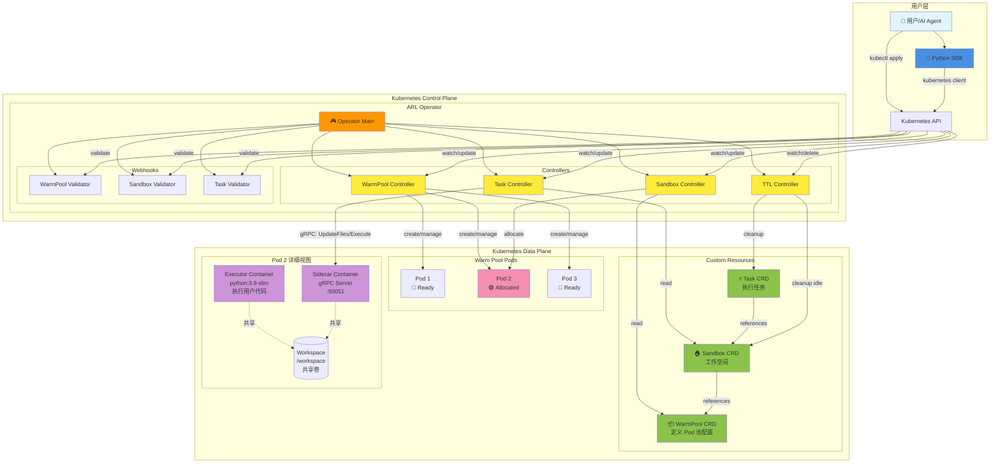
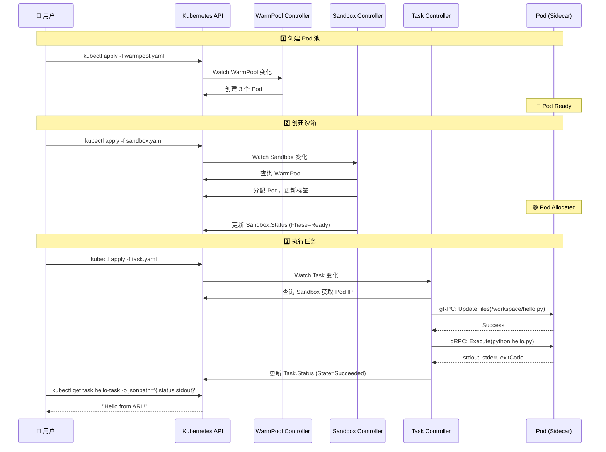
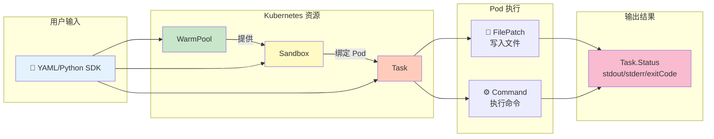

# ARL-Infra Operator 用户手册

## 📋 什么是 ARL-Infra？

ARL-Infra 是一个 Kubernetes Operator，为 AI Agent 提供**超低延迟的代码执行环境**。

---

## 🏗️ 系统架构

### 整体架构图



### 核心组件说明

| 组件 | 类型 | 职责 |
|------|------|------|
| **Operator** | 控制器管理器 | 启动和管理所有 Controller 和 Webhook |
| **WarmPool Controller** | 控制器 | 维护 Pod 池，确保有足够的空闲 Pod |
| **Sandbox Controller** | 控制器 | 从 Pool 分配 Pod，管理 Sandbox 生命周期 |
| **Task Controller** | 控制器 | 通过 gRPC 调用 Sidecar 执行任务 |
| **TTL Controller** | 控制器 | 清理完成的 Task 和空闲的 Sandbox |
| **Sidecar** | gRPC 服务器 | 在 Pod 中执行文件操作和命令 |
| **Executor** | 用户容器 | 实际运行用户代码的容器 |

### 交互流程



### 数据流



---

## 🎯 核心概念

使用 ARL-Infra 需要理解三种资源，它们按顺序协同工作：

### 1. WarmPool（Pod 池）
预先创建一组 Pod，等待分配使用。

### 2. Sandbox（沙箱）
从 Pool 中分配一个 Pod，作为你的工作空间。

### 3. Task（任务）
在 Sandbox 中执行具体的代码和命令。

**简单理解：**
```
WarmPool = 停车场（预留车位）
Sandbox  = 你租的车位
Task     = 停车和取车的操作
```

---

## 🚀 快速开始

### 第一步：创建 Pod 池

```yaml
# warmpool.yaml
apiVersion: arl.infra.io/v1alpha1
kind: WarmPool
metadata:
  name: python-pool
spec:
  replicas: 3                    # 保持 3 个空闲 Pod
  template:
    spec:
      containers:
        - name: executor
          image: python:3.9-slim
          command: ["sleep", "infinity"]
          volumeMounts:
            - name: workspace
              mountPath: /workspace
      volumes:
        - name: workspace
          emptyDir: {}
```

```bash
kubectl apply -f warmpool.yaml
```

---

### 第二步：创建沙箱

```yaml
# sandbox.yaml
apiVersion: arl.infra.io/v1alpha1
kind: Sandbox
metadata:
  name: my-workspace
spec:
  poolRef: python-pool           # 使用哪个 Pool
  keepAlive: true                # 保持沙箱用于多次任务
```

```bash
kubectl apply -f sandbox.yaml

# 等待沙箱就绪
kubectl get sandbox my-workspace -w
# 等待 PHASE 变为 Ready
```

---

### 第三步：提交任务

```yaml
# task.yaml
apiVersion: arl.infra.io/v1alpha1
kind: Task
metadata:
  name: hello-task
spec:
  sandboxRef: my-workspace       # 在哪个沙箱执行
  timeout: 30s
  steps:
    # 步骤 1: 写入 Python 文件
    - name: write-code
      type: FilePatch
      path: /workspace/hello.py
      content: |
        print("Hello from ARL!")
        print("Task executed successfully")
    
    # 步骤 2: 执行 Python 文件
    - name: run-code
      type: Command
      command: ["python", "/workspace/hello.py"]
```

```bash
kubectl apply -f task.yaml
```

---

### 第四步：查看结果

```bash
# 1. 查看任务状态
kubectl get task hello-task

# 2. 查看输出结果
kubectl get task hello-task -o jsonpath='{.status.stdout}'

# 3. 查看错误信息（如果有）
kubectl get task hello-task -o jsonpath='{.status.stderr}'

# 4. 查看退出码
kubectl get task hello-task -o jsonpath='{.status.exitCode}'

# 5. 查看完整状态
kubectl describe task hello-task
```

**预期输出：**
```
Hello from ARL!
Task executed successfully
```
